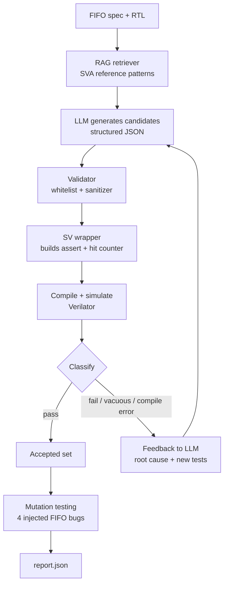

# LLM-Assisted RTL Verification Framework

**Let the LLM propose. Let the simulator decide.**

A closed-loop framework that uses a RAG-grounded LLM to generate SystemVerilog Assertions (SVA) for a FIFO design. Every candidate is compiled and simulated, failures are fed back to the LLM for root-cause analysis, and accepted assertions are stress-tested with injected RTL bugs (mutation testing). Simulation is the ground truth: nothing the LLM writes is trusted until it survives the simulator.


---

## Why this project

LLMs can write plausible SVA in seconds, but plausible is not correct. Common failures:

- Invalid syntax or references to signals that don't exist
- Assertions that are too strong and fail on legal behavior
- Assertions that pass vacuously (the antecedent never fires) and prove nothing
- Assertions that pass but would never catch a real bug

This project treats LLM output as **untrusted proposals** and uses the tool chain to filter them.

## Architecture



## Key design decisions

| Decision | Why |
|---|---|
| **LLM outputs JSON, never raw SVA** | A validator builds the assertion, which blocks syntax slips and injection, and makes vacuity measurable. |
| **Four outcomes per candidate** | `pass`, `fail`, `vacuous` (antecedent never true), `compile_error`. Only `pass` is accepted. |
| **Per-candidate compile isolation** | A line map attributes compiler errors to individual assertions, so one bad candidate doesn't sink the batch. |
| **Simulation is ground truth** | The RTL is the reference. A failing assertion is assumed wrong unless the LLM flags `possible_rtl_bug`. |
| **Mutation testing** | Passing is not enough. Accepted assertions must catch injected bugs to show they are useful. |
| **RAG over SVA patterns** | Grounds generation in valid syntax and known FIFO verification patterns. |

## Project structure

```
llm-rtl-verif/
├── rtl/fifo.sv                  # Synchronous FIFO with injectable bugs (BUG=1..4)
├── sva/fifo_props_golden.sv     # Hand-written baseline assertions
├── tb/tb_fifo.sv                # Testbench: scoreboard + directed/random stimulus
├── rag/corpus/sva_patterns.md   # Retrieval corpus of SVA reference patterns
├── src/
│   ├── rag.py                   # TF-IDF retriever
│   ├── llm.py                   # Ollama / Gemini / Claude / mock backends
│   ├── wrap.py                  # Validator + SVA module generator
│   └── sim.py                   # Verilator / Questa driver + log parsing
├── pipeline.py                  # Closed-loop orchestration + mutation testing
└── requirements.txt
```

## Injected bugs (mutation testing)

| BUG | Defect |
|---|---|
| 1 | Write accepted while full |
| 2 | Read accepted while empty |
| 3 | Full flag asserts one entry early |
| 4 | Simultaneous read and write miscounts |

## Results

Run with a free local model (`qwen2.5-coder:3b` via Ollama, no paid API):

| Metric | Result |
|---|---|
| Candidates generated | 13 |
| Accepted after simulation | 8 |
| Injected bugs caught by generated assertions | 3 of 4 |
| Injected bugs caught by testbench scoreboard | 4 of 4 |

**Finding:** BUG 4 (simultaneous read and write) was caught only by the testbench scoreboard. No assertion fired, which exposed a coverage gap in the assertion set. This is the kind of gap mutation testing is meant to reveal.

**What the feedback loop caught:**
- Assertions that ignored legal dropped writes at full and dropped reads at empty (too strong)
- References to internal signals not exposed to the testbench
- Revised fixes with no antecedent, rejected by the validator before running

Results vary by model and run. Full details are written to `out/report.json`.

## Quick start

### Requirements
- Linux, macOS, or WSL on Windows
- Python 3.10+
- Verilator 5.x (tested on 5.020)

### Install
```bash
sudo apt install -y verilator build-essential python3-venv   # macOS: brew install verilator
python3 -m venv .venv
source .venv/bin/activate
pip install -r requirements.txt
```

### Run

**Smoke test (no LLM needed):**
```bash
python pipeline.py --llm mock
```

**Free local LLM with Ollama (default):**
```bash
ollama pull qwen2.5-coder:7b        # low RAM: qwen2.5-coder:3b
python pipeline.py --llm ollama --model qwen2.5-coder:7b
```

**Gemini free tier:**
```bash
export GEMINI_API_KEY=your_key      # free key from aistudio.google.com/apikey
python pipeline.py --llm gemini
```

**Claude (optional, paid):**
```bash
pip install anthropic
export ANTHROPIC_API_KEY=your_key
python pipeline.py --llm claude
```

### Options

| Flag | Meaning | Default |
|---|---|---|
| `--llm` | `ollama`, `gemini`, `claude`, `mock` | `ollama` |
| `--model` | Model name for the chosen backend | backend default |
| `--iters` | Feedback rounds | 3 |
| `--n` | Candidates to generate | 12 |
| `--sim` | `verilator` or `questa` | `verilator` |

### Outputs
- `out/accepted_assertions.sv`: assertions that passed simulation
- `out/report.json`: accepted vs generated counts, per-candidate status, mutation results

## Limitations

- Only a FIFO design is covered so far.
- The baseline check is one scoreboard-based testbench, not a full UVM environment.
- Small local models produce weaker assertions, and some accepted assertions may be duplicates.
- Retrieval is TF-IDF over a small hand-written corpus, not embeddings.
- Formal verification is not used, so a passing assertion means "held in simulation", not "proven".

## Roadmap

- [ ] Add a property for the simultaneous read/write case to close the BUG 4 gap
- [ ] Deduplicate accepted assertions by the mutants they catch
- [ ] Extend to other designs (arbiter, FSM, AXI-lite handshake)
- [ ] Embedding-based retrieval
- [ ] Formal tool integration (SymbiYosys) for proof instead of simulation only
- [ ] Coverage-driven stimulus generation

## Tech stack

SystemVerilog · SVA · Verilator · Python · scikit-learn (TF-IDF RAG) · Ollama · Gemini API · Claude API

## Author

**Abhay Singh Jadon**
AI engineer moving into VLSI and AI for chip design.
[LinkedIn](https://www.linkedin.com/in/abhay-jadon-88434927b/)
